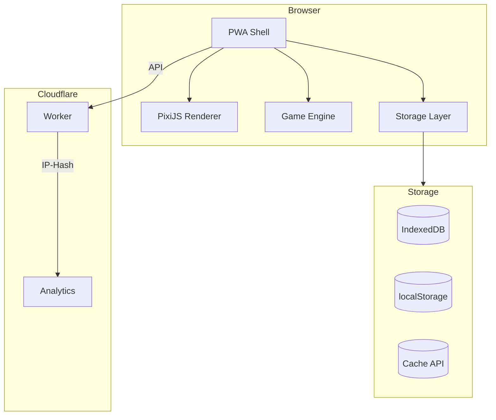
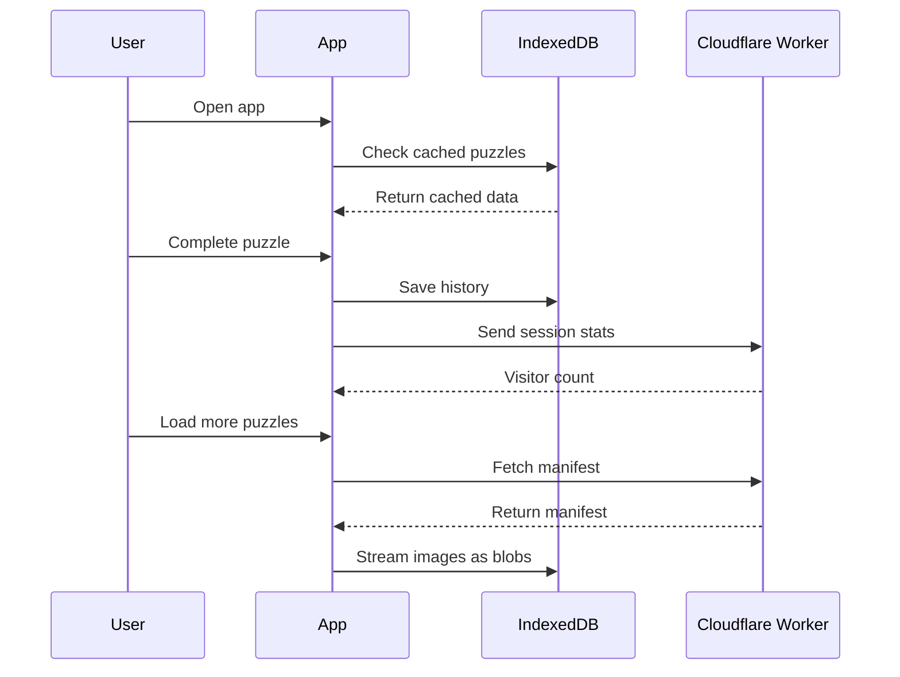

# PUZZLE.engine
`live demo expire on : march 2027`

> A data-aware, offline-first jigsaw experience built with PixiJS and IndexedDB.

 touch this: [puzzle.snorlax.online](https://puzzle.snorlax.online) 

---

## What Makes This Different

| # | Feature | Description |
|---|---------|-------------|
| 1 | **Zero-Network Repeat Visits** | IndexedDB-backed image cache. Return visitors load previously played puzzles instantly with zero network requests. |
| 2 | **Live Analytics in the UI** | Cloudflare Workers with IP-hash tracking. Visitor data surfaces directly inside the game interface. |
| 3 | **Smart Performance Scoring** | Custom rating algorithm weighing move efficiency, drag path directness, and speed -- not just completion time. |
| 4 | **Theme-Aware Rendering** | PixiJS canvas adapts to system light/dark modes in real time without manual toggles. |
| 5 | **On-Demand Puzzle Delivery** | Base install stays minimal. Players trigger "Load More" to stream additional puzzles into IndexedDB as blobs. |

---

## Architecture



---

## Data Flow



---

## Project Structure

```
PUZZLE.engine
|
|-- dist/                  Production build (PWA + Service Worker)
|-- docs/                  Architecture, decisions, dev guides
|-- functions/api/         Cloudflare Worker (stats.js)
|-- public/                Static assets (mirrors dist)
|-- src/
|   |-- animation/         PieceAnimations.js
|   |-- api/               stats.js
|   |-- app/               App.js, Game.js, GameState.js, Input.js
|   |-- game/              MovementTracker.js, SmartRating.js, Timer.js, SoundEffects.js
|   |-- image/             ImageLoader.js, ImageProcessor.js, ImageResize.js
|   |-- puzzle/            PuzzleGenerator.js, Piece.js, Shuffle.js, SeededRandom.js, PuzzleValidator.js
|   |-- renderer/          PixiApp.js, PieceRenderer.js, PuzzleRenderer.js
|   |-- services/          VisitorTracker.js
|   |-- storage/           IndexedDB.js, ImageStore.js, GameHistory.js, PuzzleStatusStore.js, SettingsStore.js
|   |-- styles/            app.css, reset.css, variables.css
|   |-- ui/                HomeView.js, GameView.js, ResultView.js, SettingsView.js
|   |-- utils/             security.js
|   |-- index.js, main.js
|-- index.html
|-- manifest.webmanifest
|-- vite.config.js
|-- _worker.js
|-- wrangler.toml
```

---

## Browser Support

| Engine | Version |
|--------|---------|
| Chromium | 90+ |
| Firefox | 88+ |
| Safari / Mobile Safari | 14+ |